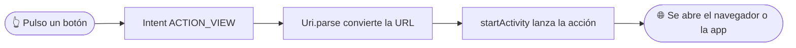

<div align="center">

# 🪪 Tarjeta de Presentación Profesional

### Reto 1 · Programación Multimedia y Dispositivos Móviles

Una tarjeta digital estilo *Linktree* con **fondo animado estilo Matrix** 💻


<br/>

<!-- 📸 CAPTURAS: guarda tus imágenes en una carpeta "screenshots" y quita los <!-- --> de abajo -->
<!--


-->

</div>

---

## 👤 Autor

| | |
|---|---|
| 🧑‍💻 **Nombre** | Nolan Martínez Gómez |
| 🐙 **GitHub** | [@MrSonbi](https://github.com/MrSonbi) |
| 📚 **Módulo** | 0489 · Programación Multimedia y Dispositivos Móviles |
| 🎯 **RA vinculado** | RA1 · Tecnologías de desarrollo para dispositivos móviles |

<div align="center">

[](https://github.com/MrSonbi)
[]()

</div>

---

## 📱 Qué es esta app

Una tarjeta de presentación digital con mi **foto de perfil**, mi **nombre**, mi **rol** y **tres botones** que abren directamente mis perfiles:

| Botón | Color | Destino |
|:---:|:---:|:---:|
| **GitHub** | Morado | Mi perfil de GitHub |
| **LinkedIn** | Azul | Mi perfil profesional |
| **CV** | Verde | Mi CV |

> 💡 **Extra:** el fondo se puede alternar a oscuro o claro haciendo la acción 'click' en la imagen ya que es un botón.

---

## ✨ Personalización añadida por mí

- ✅ Tres botones de enlace, cada uno con su propio color
- ✅ Fondo alternable a oscuro o claro haciendo click en la imagen
- ✅ Textos adaptados al fondo oscuro
- ✅ Enlaces y datos personales cambiados por los míos

---

## ⚙️ Cómo funciona



---

## 🛠️ Componentes y conceptos utilizados

| Componente / concepto | Para qué se usa en esta app |
|---|---|
| 📦 `Box` | Apila el fondo animado detrás y el contenido delante |
| 📚 `Column` | Organiza los elementos en vertical |
| 🖼️ `Image` + `clip(CircleShape)` | Foto de perfil recortada en círculo |
| 🔤 `Text` | Nombre y rol profesional |
| ↕️ `Spacer` | Separación entre elementos |
| 🔘 `Button` + `ButtonDefaults.buttonColors` | Botones con colores propios |
| 🔗 `Intent` + `Uri` | Abre el navegador en el perfil correspondiente |
| 🗂️ `res/drawable` | Carpeta de la imagen de perfil |
| 📲 `res/mipmap` | Icono personalizado de la app |
| 🏷️ `strings.xml` (`app_name`) | Nombre visible de la app bajo el icono |

---

## 🚀 Cómo ejecutar el proyecto

1. 📥 Clonar o abrir el proyecto en Android Studio
2. ⏳ Esperar a que sincronice Gradle
3. ▶️ Ejecutar sobre un emulador o un dispositivo Android real con la depuración USB activada

---

## 📂 Estructura del proyecto

```
📁 app/src/main/
 ├── 📄 java/.../MainActivity.kt    → pantalla principal: tarjeta + fondo alternable
 └── 📁 res/
      ├── 📁 drawable/               → imagen de perfil
      ├── 📁 mipmap-*/               → icono de la app
      └── 📁 values/strings.xml      → nombre visible de la app
```

---

## 🧠 Qué he aprendido

-  Cómo se estructura un proyecto Android/Kotlin con Jetpack Compose
-  Cómo importar y organizar imágenes en `res/drawable`
-  Cómo maquetar con `Box`, `Column`, `Image`, `Text`, `Spacer` y `Button`
-  Cómo personalizar los colores de un botón con `ButtonDefaults.buttonColors`
-  Cómo lanzar una URL externa desde un botón con `Intent` + `Uri`
-  Cómo crear un fondo alternable a oscuro
-  Cómo cambiar el icono y el nombre visible de la app
-  Cómo subir el proyecto a GitHub y resolver un `push` rechazado

---

## 🐞 Dificultades y cómo las resolví

<details>
<summary>🎨 <b>Error en el color del botón</b></summary>

Usé `container` en vez de `containerColor` dentro de `buttonColors`, y me faltaba cerrar un paréntesis. **Solución:** corregir el nombre del parámetro y revisar la estructura del `Button`.
</details>

<details>
<summary>📦 <b>Imports que faltaban</b></summary>

Android Studio marcaba en rojo `Canvas`, `Box`, etc. **Solución:** `Alt + Enter` sobre cada palabra para que el IDE añadiera el import.
</details>

<details>
<summary>🚫 <b><code>git push</code> rechazado (fetch first)</b></summary>

GitHub tenía commits que yo no tenía en local. **Solución:** `git add -A`, `git commit`, `git pull --rebase` y `git push`.
</details>

<details>
<summary>📁 <b>Cambios sin añadir por estar en una subcarpeta</b></summary>

`git add .` solo añade lo de la carpeta actual y los archivos borrados de la carpeta superior se quedaban fuera. **Solución:** usar `git add -A`.
</details>
